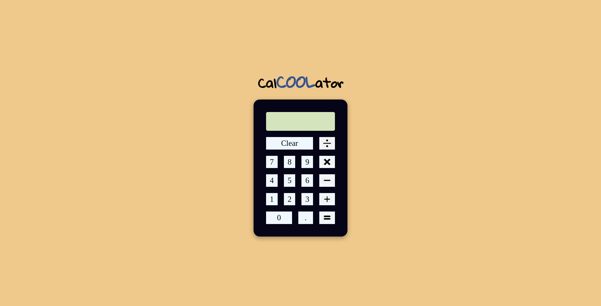

# TOP-Calculator

A JS Project as part of the odin project

## Project Description

A webpage featuring a working basic calculator

## Technology

- HTML
- CSS
- JS

## Skills Demonstrated

- Layout manipulation using flexbox
- Using flags as states within the code flow
- Knowledge of scopes
- Foreach method on node lists
- Breaking down and solving subproblems
- Learned that parseInt truncates decimals and found out a more suitable method

## Things to Work On

- Keep the code DRY
- Implement keyboard functionality
